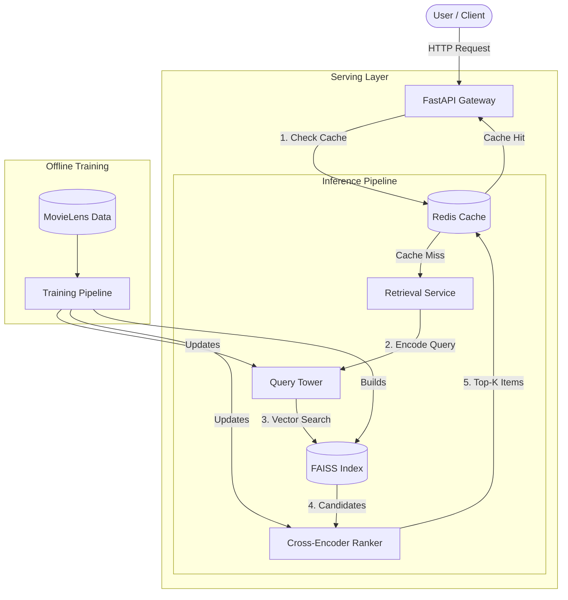

[](https://github.com/zheliu17/nanoRecSys/actions/workflows/ci.yml)
[](https://www.apache.org/licenses/LICENSE-2.0)

# nanoRecSys: End-to-End Production Recommender System

nanoRecSys is a full-lifecycle recommendation system implementation designed to mimic real-world production constraints. It implements a **two-stage pipeline (Retrieval & Ranking)** and includes a high-throughput **serving engine** backed by Redis and FAISS.

https://github.com/user-attachments/assets/062010f5-1fa1-45f6-9586-6379ecba305d

## Key Features

* **Two-Stage Architecture:**
    * **Retrieval:** Two-Tower (Dual Encoder) model with InfoNCE loss and LogQ correction for popularity bias.
    * **Ranking:** Cross-Encoder MLP fusing user/item embeddings with metadata (Genres, Years) and popularity.
* **Production Serving Stack:**
    * **FastAPI** inference server with Redis caching.
    * **FAISS IVF-PQ** index for <1 ms vector retrieval.
    * **Docker Compose** orchestration for API, Frontend (Streamlit), and Cache.


## Evaluation & Benchmarks
*For training and evaluation details, see [Training.md](./notebooks/Training.md)*

We employ two evaluation strategies to validate model performance:

* **Academic Benchmark (Leave-One-Out)**
    * **Goal:** Compare against standard literature (e.g., [Neural collaborative filtering](https://dl.acm.org/doi/abs/10.1145/3038912.3052569)).
    * **Result:** nanoRecSys outperforms the NCF baseline.

* **Production Simulation (Temporal Split)**
    * **Goal:** Simulate real-world deployment.
    * **Method:** Train on past data, Test on the *last 5 interactions* of users (strict temporal separation).


## Scalability (IVF-PQ & Latency)

*For detailed latency analysis and load testing results, see [Benchmark.md](./notebooks/Benchmark.md)*

## Quick Start

> **Fast Track:** We provide a `Makefile` to simplify common tasks.
> ```bash
> # export WANDB_MODE=offline
> make install        # (Equivalent to pip install -e .)
> make train-all      # Run full data, training, and indexing pipeline
> make serve          # (Equivalent to docker-compose up --build)
> ```

### 1. Installation
```bash
git clone https://github.com/zheliu17/nanoRecSys.git
cd nanoRecSys

# Install dependencies (Virtual Environment recommended)
pip install -e .
```

### 2. Training & Artifact Generation
See [Training.md](./notebooks/Training.md) for detailed steps. You need to run the [Production Training Notebook](./notebooks/production_training.ipynb) to generate the necessary model artifacts (`*.pth`, `*.npy`, `*.index`) in the `artifacts/` folder.

### 3. Serving
Once artifacts are generated, launch the full stack (API, Cache, Frontend):
```bash
# python -m nanoRecSys.indexing.build_faiss_ivfpq --nlist 64 --m 16
docker-compose up --build
```

### 4. Testing (Optional)
Run unit and integration tests:
```bash
pytest tests/
```


## System Architecture




## Project Structure
```text
.
├── artifacts/             # Trained models & indices (GitIgnored)
├── data/                  # Dataset storage
├── frontend/              # Streamlit UI
├── notebooks/             # Training & Analysis Notebooks
├── serving/               # FastAPI Inference Server
├── src/
│   └── nanoRecSys/        # Core Library
├── tests/                 # Unit & Integration Tests
└── docker-compose.yml     # Orchestration
```
