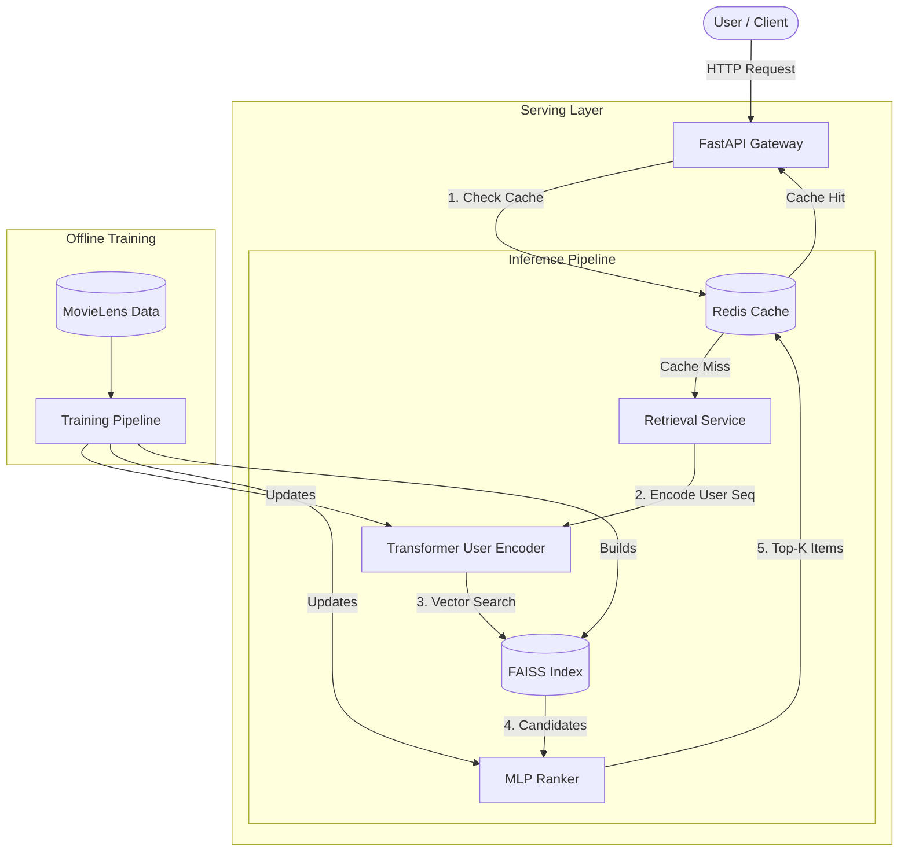

[](https://github.com/zheliu17/nanoRecSys/actions/workflows/ci.yml)
[](https://www.apache.org/licenses/LICENSE-2.0)

# nanoRecSys: Production-Style Sequential Recommender System

**nanoRecSys** is an end-to-end recommender system project designed to reflect real production constraints (latency, caching, indexing, and operational workflows). It aims to bridge research ideas (modern sequential retrieval) and practical serving (CPU-friendly inference + vector search).

<https://github.com/user-attachments/assets/6d0c4713-c8ab-43ba-b197-d2602244cf35>

## Key Features

* **Modern Retrieval Architecture:** Implemented a **Sequential Transformer** (SASRec-based) enhanced with RoPE, SwiGLU, and InfoNCE Loss.
  * **0.286 HR@10** on MovieLens-20M, outperforming standard SASRec baselines by ~40% and matching optimized implementations (e.g., BERT4Rec).
* **High-Throughput Serving:** Built a FastAPI inference engine backed by Redis (caching)   and **FAISS** (vector search).
* **Production Engineering:** Features a complete Docker Compose orchestration, CI/CD workflows, and a Streamlit frontend.
* **Full-Lifecycle Implementation:** From raw data processing and offline training (PyTorch) to online serving and latency benchmarking.

## Evaluation & Benchmarks

*See [Training.md](./notebooks/Training.md) for architectural deep-dives and [Benchmark.md](./notebooks/Benchmark.md) for latency analysis.*

### Offline Performance

Compared against recent literature (ICML'24, WWW'25), our retrieval model performs competitively:

| Metric | Our Model | Standard SASRec | SOTA (HSTU/FuXi-$\alpha$) |
| :--- | :--- | :--- | :--- |
| **HR@10** | **0.286** | ~0.20 - 0.29 | ~0.33 |

### Online Latency

Load tested with `locust` on a CPU-only laptop setup:

* **P95 Latency:** 180ms (example run; workload and hardware dependent)
* **Cold-path inference:** <90ms (example run; transformer user embedding + FAISS + ranking)

## Quick Start

You have three options to get started:

1. **Train from scratch (~10 hrs):** Train the high-performance Sequential Transformer.
2. **Download Pre-trained:** Skip training and use our hosted artifacts.
3. **Train Baseline (<5 mins):** Train a simple Matrix Factorization model for quick testing.

> **Fast Track:** We provide a `Makefile` to simplify common tasks.
>
> ```bash
> # export WANDB_MODE=offline
> make install        # (Equivalent to pip install -e .)
>
> # Option 1: Train from scratch
> make train-retriever
>
> # Option 3: Train simple baseline
> make train-retriever-mlp
>
> make serve          # (Equivalent to docker-compose up --build)
> ```

### 1. Installation

```bash
git clone https://github.com/zheliu17/nanoRecSys.git
cd nanoRecSys

# Install dependencies (Virtual Environment recommended)
pip install -e .
```

### 2. Training & Artifact Generation

See [Training.md](./notebooks/Training.md) for detailed steps. You need to run the [Sequential Transformer Notebook](./notebooks/sequential_transformer.ipynb) (or use `make train-retriever`) to generate the necessary model artifacts (`*.pth`, `*.npy`, `*.index`) in the `artifacts/` folder.

### 3. Serving

Once artifacts are generated, launch the full stack (API, Cache, Frontend):

```bash
# python -m nanoRecSys.indexing.build_faiss_ivfpq --nlist 64 --m 16
docker-compose up --build
```

### 4. Testing (Optional)

Run unit and integration tests:

```bash
pytest tests/
```

## System Architecture



## Project Structure

```text
.
├── artifacts/             # Trained models & indices (GitIgnored)
├── data/                  # Dataset storage
├── frontend/              # Streamlit UI
├── notebooks/             # Training & Analysis Notebooks
├── serving/               # FastAPI Inference Server
├── src/
│   └── nanoRecSys/        # Core Library
├── tests/                 # Unit & Integration Tests
└── docker-compose.yml     # Orchestration
```
