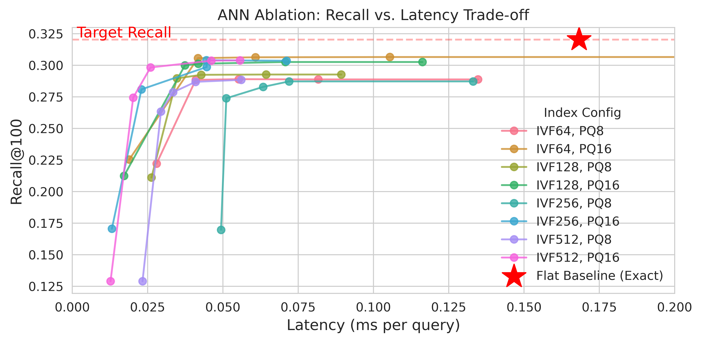
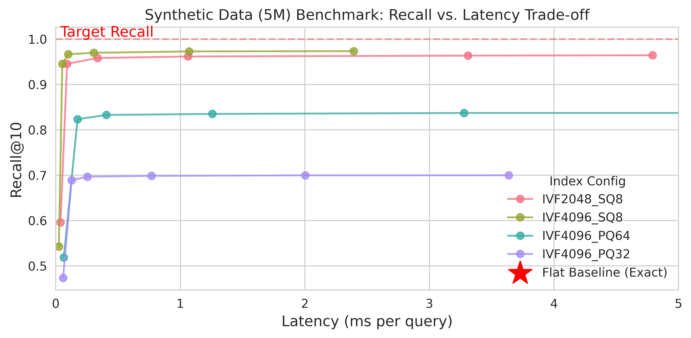
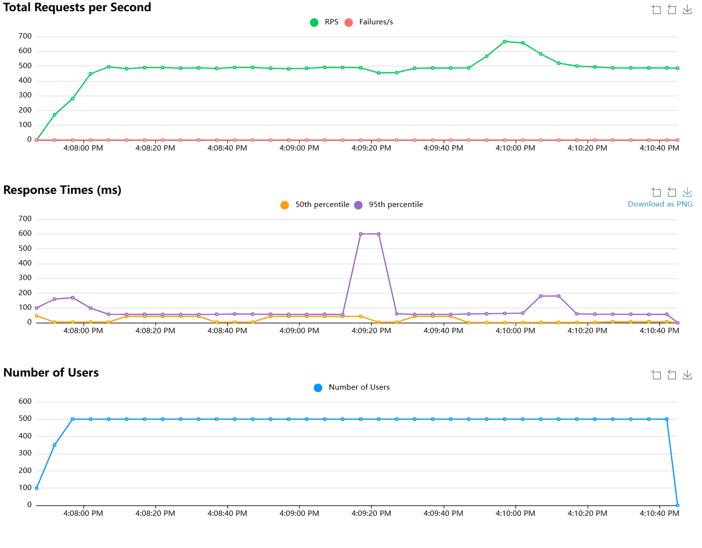

## ANN Ablation Results[^1]

ANN Albations on MovieLens-20M Dataset (27k items):
```bash
python -m src.nanoRecSys.indexing.benchmark_ivfpq
```

For a balanced trade-off between latency and recall, we recommend using **IVF64,PQ16**.
The figure below is generated on colab CPU instance (2@2.2GHz). Conclusions are similar on other hardware.



## Synthetic Expansion to 5M Items

We synthetically expand original 27k items to 5 million[^2].
```bash
python -m src.nanoRecSys.indexing.synthetic_expand
python -m src.nanoRecSys.indexing.benchmark_synthetic --target_count 5_000_000
```

Choose `faiss.IndexFlatIP` as baseline (Recall@10=1.0). Flat Latency is ~30 ms/query on colab CPU instance (2@2.2GHz).



## Latency under Load Testing[^3]

Build IVF-PQ Index, start the FastAPI server, and run Load Testing (`locust`):
```bash
python -m src.nanoRecSys.indexing.build_faiss_ivfpq --nlist 64 --m 16
docker-compose up --build -d
locust -f locustfile.py
```

A sample of latency statistics with 500 users and spawn rate of 50 (total 42819 requests over 3 minutes) on a local machine:


| Type | Name              | # Requests | # Fails | Median (ms) | 95%ile (ms) | 99%ile (ms) | Average (ms) | Min (ms) | Max (ms) |
|------|-------------------|------------|---------|-------------|-------------|-------------|--------------|----------|----------|
| POST | /recommend        | 42819      | 0       | 51          | 80          | 370         | 60.49        | 3        | 820      |
| DB   | Embedding         | 990        | 0       | 1           | 2           | 9           | 0.9          | 0        | 13       |
| DB   | Ranking           | 990        | 0       | 1           | 3           | 11          | 1.54         | 1        | 33       |
| DB   | Retrieval         | 990        | 0       | 0.12        | 0           | 1           | 0.24         | 0        | 11       |
| DB   | Server_Processing | 42819      | 0       | 0.12        | 1           | 3           | 0.47         | 0        | 188      |
|      | Aggregated        | 88608      | 0       | 1           | 60          | 200         | 29.49        | 0        | 820      |

`Server_Processing` is the total Python processing time per request (excluding network overhead).
This result suggests the bottleneck is mostly in the **Redis Network I/O + JSON Parsing**.



[^1]: See [Training.md](./Training.md) for training and embedding generations.
[^2]: Generate independent random vectors matching global stats (mean, std) of original item embeddings, see `src.nanoRecSys.indexing.synthetic_expand` module.
[^3]: For benchmarking purpose, we collect timings from HTTP response body. In production, consider using APM tools like OpenTelemetry or Prometheus for more accurate measurements.
